fem_resp_final
================
Dwight Gonzales
2025-05-19

``` r
fem_resp<-read.csv("C:/Users/DWIGHT JIRO/Downloads/NSFG_2022_2023_FemRespPUFData.csv")

count_vars <- names(fem_resp)[sapply(fem_resp, is.numeric)]
nominal_vars <- names(fem_resp)[sapply(fem_resp, function(x) (is.factor(x) || is.character(x)) && length(unique(x)) <= 10)]
ordered_vars <- names(fem_resp)[sapply(fem_resp, is.ordered)]
demographic_vars <- names(fem_resp)[grepl("age|gender|sex|education|race|ethnicity", names(fem_resp), ignore.case = TRUE)]


# Overall missing value count
sum(is.na(fem_resp))
```

    ## [1] 6461926

# Data Cleaning

``` r
for (i in 1:ncol(fem_resp)) {
  column <- fem_resp[[i]]
  
  if (is.numeric(column)) {
    if (all(is.na(column))) {
      # All NA numeric  replace with 0
      fem_resp[[i]] <- rep(0, length(column))
    } else {
      # Impute numeric with mean
      col_mean <- mean(column, na.rm = TRUE)
      fem_resp[[i]][is.na(column)] <- col_mean
    }
    
  } else if (is.factor(column) || is.character(column)) {
    if (all(is.na(column))) {
      # All NA factor/character  replace with "Missing"
      fem_resp[[i]] <- rep("Missing", length(column))
      if (is.factor(column)) {
        fem_resp[[i]] <- factor(fem_resp[[i]])
      }
    } else {
      # Impute factor/character with mode
      tab <- table(column)
      mode_value <- names(sort(tab, decreasing = TRUE))[1]
      fem_resp[[i]][is.na(column)] <- mode_value
      
      if (is.factor(column)) {
        fem_resp[[i]] <- factor(fem_resp[[i]])
      }
    }
  }
}

fem_resp <- fem_resp[, colSums(is.na(fem_resp)) < nrow(fem_resp)]

sum(is.na(fem_resp))
```

    ## [1] 0

``` r
fem_resp[nominal_vars] <- lapply(fem_resp[nominal_vars], factor)
fem_resp[ordered_vars] <- lapply(fem_resp[ordered_vars], factor)
```

# EDA and Multiple Comparisons

``` r
library(patchwork)
```

    ## Warning: package 'patchwork' was built under R version 4.3.3

``` r
library(ggplot2)
```

    ## Warning: package 'ggplot2' was built under R version 4.3.3

``` r
library(scales)
```

    ## Warning: package 'scales' was built under R version 4.3.3

``` r
#Respondents age as reported in screener distribution

p1<-ggplot(fem_resp, 
       aes(x = RSCRAGE, y= after_stat(count/sum(count)))) +
  geom_histogram(fill = "cornflowerblue", 
                 color = "white", 
                 binwidth = 5) + 
  labs(title="Participants by age in screener  - Female", 
       y = "Percent",
       x = "Age") +
  scale_y_continuous(labels = percent)

#R's age at interview 

p2<-ggplot(fem_resp, 
       aes(x = AGE_R, y= after_stat(count/sum(count)))) +
  geom_histogram(fill = "red", 
                 color = "white", 
                 binwidth = 5) + 
  labs(title="Participants by age at interview - Female", 
       y = "Percent",
       x = "Age") +
  scale_y_continuous(labels = percent)

p1+p2
```

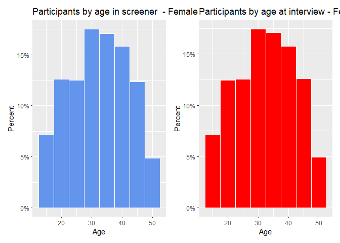<!-- -->

No difference at most, it means the participants responded accordingly
to screen and interview

``` r
# How many females had sex with a male

fem_resp$RHADSEX <- factor(fem_resp$RHADSEX, levels = c(1, 5), labels = c("Yes", "No"))

  ggplot(fem_resp, 
           aes(x = RHADSEX, y= after_stat(count/sum(count)))) +
    geom_bar(fill = "cornflowerblue", 
                 color = "white") + 
  labs(title="Participants by age at interview - Female", 
       y = "Percent",
       x = "Age") +
  scale_y_continuous(labels = percent)
```

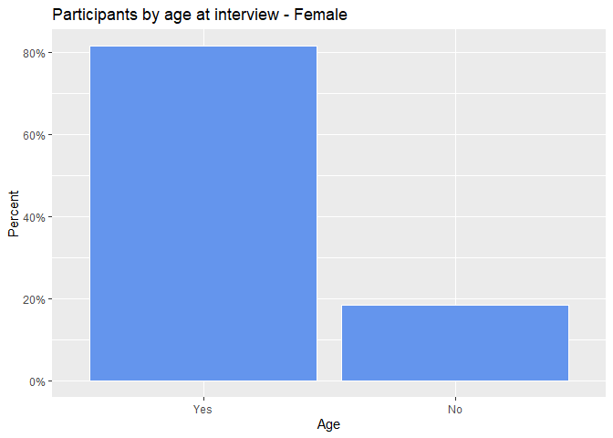<!-- -->

``` r
  # Age at 1st Sex-Last in Last 12 mos 
  
  library(dplyr)
```

    ## Warning: package 'dplyr' was built under R version 4.3.3

    ## 
    ## Attaching package: 'dplyr'

    ## The following objects are masked from 'package:stats':
    ## 
    ##     filter, lag

    ## The following objects are masked from 'package:base':
    ## 
    ##     intersect, setdiff, setequal, union

``` r
  library(forcats)
```

    ## Warning: package 'forcats' was built under R version 4.3.3

``` r
  library(scales)
  
  fem_resp <- fem_resp %>%
    mutate(
      P1YHSAGE_CAT = case_when(
        P1YHSAGE >= 0 & P1YHSAGE <= 17 ~ "Under 18 years",
        P1YHSAGE >= 18 & P1YHSAGE <= 19 ~ "18-19 years",
        P1YHSAGE >= 20 & P1YHSAGE <= 24 ~ "20-24 years",
        P1YHSAGE >= 25 & P1YHSAGE <= 34 ~ "25-34 years",
        P1YHSAGE >= 35 & P1YHSAGE <= 49 ~ "35-49 years",
        P1YHSAGE >= 50 & P1YHSAGE <= 95 ~ "50 years or older",
        P1YHSAGE == 98 ~ "Refused",
        P1YHSAGE == 99 ~ "Don't know",
        is.na(P1YHSAGE) ~ "Inapplicable",
        TRUE ~ "Other/Unexpected"
      )
    ) %>%
    filter(!P1YHSAGE_CAT %in% c("Refused", "Don't know", "Inapplicable", "Other/Unexpected")) %>%
    mutate(P1YHSAGE_CAT = factor(
      P1YHSAGE_CAT,
      levels = c("Under 18 years", "18-19 years", "20-24 years",
                 "25-34 years", "35-49 years", "50 years or older")
    ))
  
  
  ggplot(fem_resp, aes(x = P1YHSAGE_CAT)) +
    geom_bar(aes(y = after_stat(count / sum(count))),
             fill = "cornflowerblue", color = "white") +
    scale_y_continuous(labels = percent_format()) +
    labs(title = "Distribution of Age at First Sex",
         x = "Age Group",
         y = "Percent") +
    theme(axis.text.x = element_text(angle = 45, hjust = 1))
```

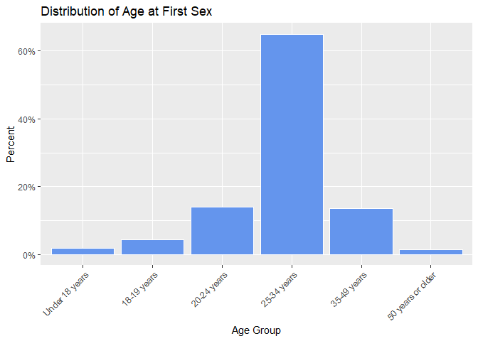<!-- -->

``` r
  # R not using a method because want to become preg 
  
  fem_resp$WYNOTUSE <- factor(fem_resp$WYNOTUSE,
                              levels = c(1, 5, 8, 9),
                              labels = c("Yes", "No", "Refused", "Don't Know"))
  
  fem_clean <- fem_resp %>%
    filter(WYNOTUSE %in% c("Yes", "No"))
  
  ggplot(fem_clean, aes(x = WYNOTUSE)) +
    geom_bar(aes(y = after_stat(count / sum(count))),
             fill = "cornflowerblue", color = "white") +
    scale_y_continuous(labels = scales::percent_format()) +
    labs(title = "Females Not Using Contraceptive Method Because Want to Become Pregnant",
         x = "Response",
         y = "Percent")
```

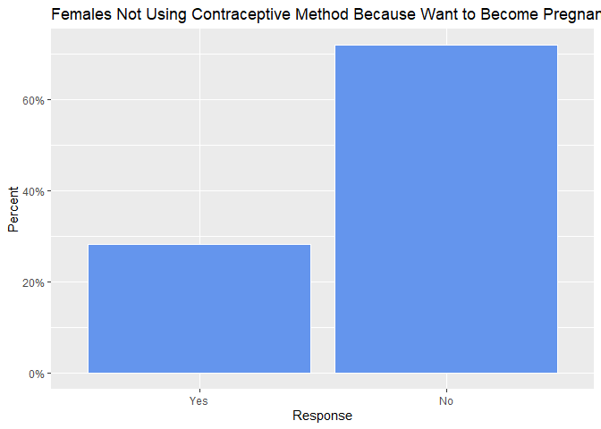<!-- -->

``` r
#Epmploymet status

  fem_resp$RWRKST <- factor(fem_resp$RWRKST, levels = c(1, 5), labels = c("Yes", "No"))
  
  ggplot(fem_resp, 
         aes(x = RHADSEX, y= after_stat(count/sum(count)))) +
    geom_bar(fill = "cornflowerblue", 
             color = "white") + 
    labs(title="Whether R is currently employed - Female", 
         y = "Percent",
         x = "Response") +
    scale_y_continuous(labels = percent)
```

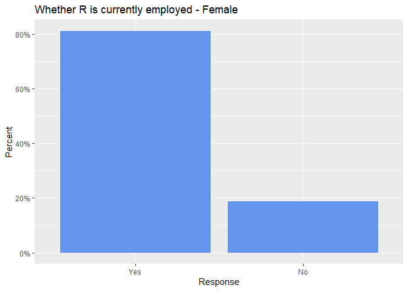<!-- -->

``` r
  fem_degree_years <- fem_resp %>%
    filter(EARNBA_Y >= 1972 & EARNBA_Y <= 2023)
  
  ggplot(fem_degree_years, aes(x = EARNBA_Y)) +
    geom_histogram(binwidth = 2, fill = "#4682B4", color = "white") +
    scale_x_continuous(breaks = seq(1972, 2023, 5)) +
    labs(title = "Year Bachelor's Degree Was Earned (Females)",
         x = "Year",
         y = "Count") +
    theme_minimal(base_size = 14) +
    theme(
      plot.title = element_text(face = "bold", size = 16, hjust = 0.5),
      axis.text.x = element_text(angle = 45, hjust = 1)
    )
```

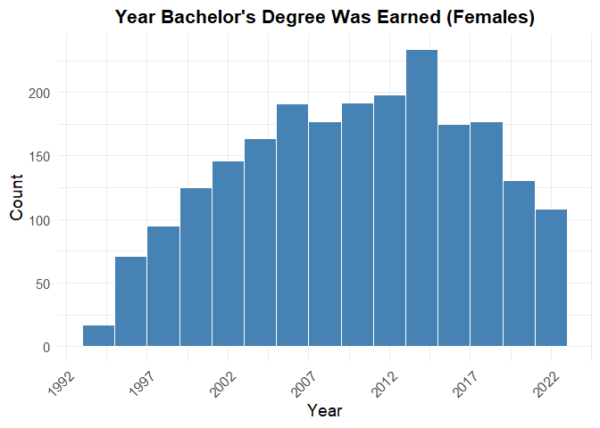<!-- -->

``` r
  #Living status
  
  fem_resp$ONOWN18 <- factor(fem_resp$ONOWN18, levels = c(1, 5), labels = c("Yes", "No"))
  
  ggplot(fem_resp, 
         aes(x = RHADSEX, y= after_stat(count/sum(count)))) +
    geom_bar(fill = "cornflowerblue", 
             color = "white") + 
    labs(title="Whether R lived on own before age 18 - Female", 
         y = "Percent",
         x = "Response") +
    scale_y_continuous(labels = percent)
```

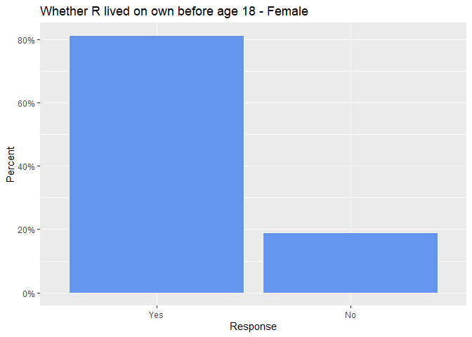<!-- -->

``` r
  library(dplyr)
  
  fem_model <- fem_resp %>%
    filter(WYNOTUSE %in% c("Yes", "No")) %>%  # keep only valid responses
    mutate(
      WYNOTUSE_BIN = ifelse(WYNOTUSE == "Yes", 1, 0),  # binary outcome
      EARNBA_NUM = as.numeric(as.character(EARNBA_Y)), # numeric year
      AGE = as.numeric(as.character(RSCRAGE)),         # age variable
      ONOWN18 = factor(ONOWN18, levels = c("Yes", "No"))
    ) %>%
    filter(!is.na(EARNBA_NUM), !is.na(AGE), !is.na(ONOWN18))
  

  
  
  
  ggplot(fem_resp, 
         aes(x = DURTRY_N, y= after_stat(count/sum(count)))) +
    geom_histogram(fill = "cornflowerblue", 
                   color = "white", 
                   binwidth = 5) + 
    labs(title="Participants by age in screener  - Female", 
         y = "Percent",
         x = "Age") +
    scale_y_continuous(labels = percent)
```

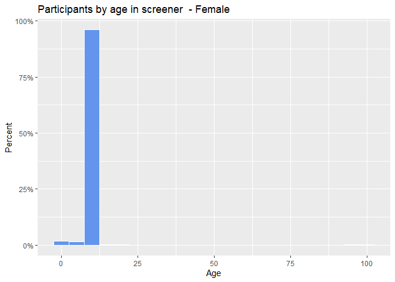<!-- -->

``` r
  fem_durtry <- fem_resp %>%
    mutate(DURTRY_N = as.numeric(as.character(DURTRY_N))) %>%
    filter(!is.na(DURTRY_N), DURTRY_N >= 0, DURTRY_N <= 28, DURTRY_N == floor(DURTRY_N))
  
  durtry_dist <- fem_durtry %>%
    count(DURTRY_N) %>%
    mutate(percent = n / sum(n))
  
  ggplot(durtry_dist, aes(x = DURTRY_N, y = percent)) +
    geom_line(color = "steelblue", size = 1) +
    geom_point(color = "steelblue", size = 2) +
    scale_y_continuous(labels = percent_format()) +
    labs(
      title = "Distribution of Duration Trying to Get Pregnant",
      x = "Duration (months)",
      y = "Percent"
    ) +
    theme_minimal()
```

    ## Warning: Using `size` aesthetic for lines was deprecated in ggplot2 3.4.0.
    ## ℹ Please use `linewidth` instead.
    ## This warning is displayed once every 8 hours.
    ## Call `lifecycle::last_lifecycle_warnings()` to see where this warning was
    ## generated.

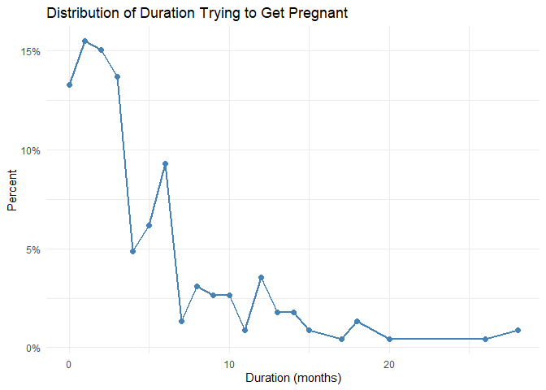<!-- -->

# Poisson regression and usingsome demographic and behavioral predictor for” How long been trying to become preg”

``` r
library(knitr)
suppressWarnings({
poisson_model <- glm(DURTRY_N ~ EARNBA_NUM + AGER + ONOWN18 + FMARITAL + SEEKADPT + EVERSEX,
                       data = fem_model,
                       family = poisson())
  
summary(poisson_model)
})
```

    ## 
    ## Call:
    ## glm(formula = DURTRY_N ~ EARNBA_NUM + AGER + ONOWN18 + FMARITAL + 
    ##     SEEKADPT + EVERSEX, family = poisson(), data = fem_model)
    ## 
    ## Coefficients:
    ##               Estimate Std. Error z value Pr(>|z|)    
    ## (Intercept)  0.6456375  1.9383967   0.333   0.7391    
    ## EARNBA_NUM   0.0005693  0.0009548   0.596   0.5510    
    ## AGER         0.0062136  0.0014434   4.305 1.67e-05 ***
    ## ONOWN18No   -0.0134577  0.0273172  -0.493   0.6223    
    ## FMARITAL     0.0140221  0.0060713   2.310   0.0209 *  
    ## SEEKADPT     0.0779507  0.0182208   4.278 1.88e-05 ***
    ## EVERSEX      0.0019278  0.0152815   0.126   0.8996    
    ## ---
    ## Signif. codes:  0 '***' 0.001 '**' 0.01 '*' 0.05 '.' 0.1 ' ' 1
    ## 
    ## (Dispersion parameter for poisson family taken to be 1)
    ## 
    ##     Null deviance: 6553.8  on 865  degrees of freedom
    ## Residual deviance: 6510.7  on 859  degrees of freedom
    ## AIC: Inf
    ## 
    ## Number of Fisher Scoring iterations: 5

``` r
#Overdispersion Test

deviance(poisson_model) / df.residual(poisson_model)
```

    ## [1] 7.57939

# overdispersion, so we can use Negative Binomial regression instead

``` r
library(MASS)
```

    ## 
    ## Attaching package: 'MASS'

    ## The following object is masked from 'package:dplyr':
    ## 
    ##     select

    ## The following object is masked from 'package:patchwork':
    ## 
    ##     area

``` r
suppressWarnings({
  neg_bin_model <- glm.nb(DURTRY_N ~ EARNBA_NUM + AGER + ONOWN18 + FMARITAL + SEEKADPT + EVERSEX,
                        data = fem_model)

  summary(neg_bin_model)
})
```

    ## 
    ## Call:
    ## glm.nb(formula = DURTRY_N ~ EARNBA_NUM + AGER + ONOWN18 + FMARITAL + 
    ##     SEEKADPT + EVERSEX, data = fem_model, init.theta = 2.155596315, 
    ##     link = log)
    ## 
    ## Coefficients:
    ##               Estimate Std. Error z value Pr(>|z|)  
    ## (Intercept)  0.5973866  4.9042337   0.122   0.9030  
    ## EARNBA_NUM   0.0005563  0.0024159   0.230   0.8179  
    ## AGER         0.0060244  0.0036463   1.652   0.0985 .
    ## ONOWN18No   -0.0203119  0.0689454  -0.295   0.7683  
    ## FMARITAL     0.0139238  0.0152805   0.911   0.3622  
    ## SEEKADPT     0.0958136  0.0420683   2.278   0.0228 *
    ## EVERSEX      0.0015754  0.0381556   0.041   0.9671  
    ## ---
    ## Signif. codes:  0 '***' 0.001 '**' 0.01 '*' 0.05 '.' 0.1 ' ' 1
    ## 
    ## (Dispersion parameter for Negative Binomial(2.1556) family taken to be 1)
    ## 
    ##     Null deviance: 969.82  on 865  degrees of freedom
    ## Residual deviance: 962.07  on 859  degrees of freedom
    ## AIC: 5860.3
    ## 
    ## Number of Fisher Scoring iterations: 1
    ## 
    ## 
    ##               Theta:  2.156 
    ##           Std. Err.:  0.123 
    ## 
    ##  2 x log-likelihood:  -5844.336

``` r
#Overdispersion test

deviance(poisson_model) / df.residual(poisson_model) #good ≈ 1 
```

    ## [1] 7.57939

``` r
fem_model$SEEKADPT_factor <- factor(fem_model$SEEKADPT,
                                    levels = c(1, 5),
                                    labels = c("Yes", "No"))

fem_model$EVERSEX_factor <- factor(fem_model$EVERSEX,
                                   levels = c(1, 5, 7, 8, 9),
                                   labels = c("Yes", "No", "Not Ascertained", "Refused", "Don't Know"))

fem_model_clean <- subset(fem_model, 
                          EVERSEX_factor %in% c("Yes", "No") & 
                            !is.na(SEEKADPT_factor))
```

# contingency tables

``` r
table(fem_model_clean$FMARITAL, fem_model_clean$EVERSEX_factor)
```

    ##    
    ##     Yes No Not Ascertained Refused Don't Know
    ##   5  80  0               0       0          0

``` r
table(fem_model_clean$ONOWN18, fem_model_clean$SEEKADPT_factor)
```

    ##      
    ##       Yes No
    ##   Yes   0 11
    ##   No    0 69

``` r
# Age group as before and table with EVERSEX_factor

fem_model_clean$AGER_group <- cut(fem_model_clean$AGER, breaks=c(0,20,30,40,50,Inf), right=FALSE)
table(fem_model_clean$AGER_group, fem_model_clean$EVERSEX_factor)
```

    ##           
    ##            Yes No Not Ascertained Refused Don't Know
    ##   [0,20)    16  0               0       0          0
    ##   [20,30)   44  0               0       0          0
    ##   [30,40)   16  0               0       0          0
    ##   [40,50)    4  0               0       0          0
    ##   [50,Inf)   0  0               0       0          0

``` r
# Create the contingency table 
tab1 <- table(fem_model_clean$FMARITAL, fem_model_clean$EVERSEX_factor)

# Run Chi-square test
chisq.test(tab1)
```

    ## 
    ##  Chi-squared test for given probabilities
    ## 
    ## data:  tab1
    ## X-squared = 320, df = 4, p-value < 2.2e-16

``` r
tab2 <- table(fem_model_clean$ONOWN18, fem_model_clean$SEEKADPT_factor)
chisq.test(tab2)
```

    ## Warning in chisq.test(tab2): Chi-squared approximation may be incorrect

    ## 
    ##  Pearson's Chi-squared test
    ## 
    ## data:  tab2
    ## X-squared = NaN, df = 1, p-value = NA

``` r
#MARITAL × EVERSEX: Strong, significant association.

fisher.test(tab2) #No statistically significant association between home ownership and seeking adoption
```

    ## 
    ##  Fisher's Exact Test for Count Data
    ## 
    ## data:  tab2
    ## p-value = 1
    ## alternative hypothesis: true odds ratio is not equal to 1
    ## 95 percent confidence interval:
    ##    0 Inf
    ## sample estimates:
    ## odds ratio 
    ##          0

``` r
# For FMARITAL × EVERSEX_factor
table(fem_model_clean$FMARITAL, fem_model_clean$EVERSEX_factor)
```

    ##    
    ##     Yes No Not Ascertained Refused Don't Know
    ##   5  80  0               0       0          0

``` r
mosaicplot(tab1,
           main = "Marital Status vs. EVERSEX",
           color = TRUE,
           shade = TRUE,
           las = 1,
           xlab = "Marital Status",
           ylab = "EVERSEX")
```

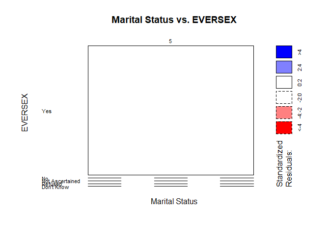<!-- -->

``` r
table(fem_model_clean$ONOWN18, fem_model_clean$SEEKADPT_factor)
```

    ##      
    ##       Yes No
    ##   Yes   0 11
    ##   No    0 69

``` r
mosaicplot(tab2,
           main = "Own Home vs. SEEKADPT",
           color = TRUE,
           shade = TRUE,
           las = 1,
           xlab = "Own Home",
           ylab = "SEEKADPT")
```

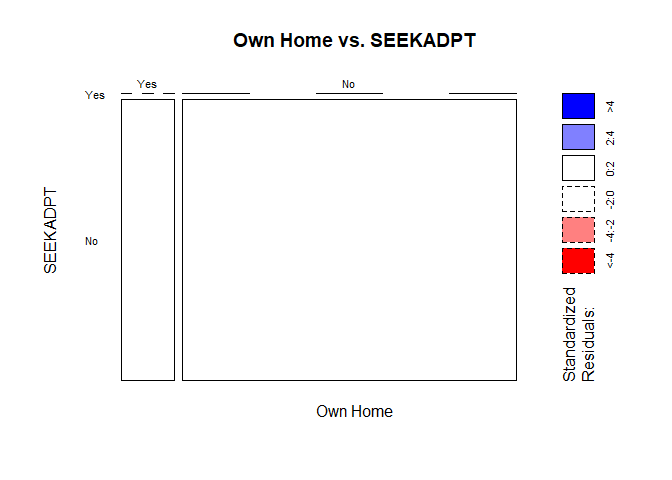<!-- -->

``` r
# Heatmap for FMARITAL × EVERSEX_factor
library(ggplot2)

# Convert table to data frame
tab1_df <- as.data.frame(tab1)
colnames(tab1_df) <- c("FMARITAL", "EVERSEX", "Freq")

# Plot
ggplot(tab1_df, aes(x = EVERSEX, y = FMARITAL, fill = Freq)) +
  geom_tile(color = "white") +
  scale_fill_gradient(low = "white", high = "red") +
  labs(title = "Heatmap: Marital Status vs. EVERSEX",
       x = "EVERSEX",
       y = "Marital Status") +
  theme_minimal()
```

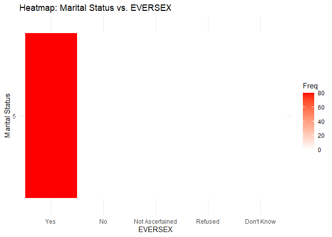<!-- -->

# ordinal logistic regression for PHYSABUSE_factor

``` r
fem_model_clean <- subset(fem_model, PHYSABUSE %in% 1:5)

fem_model_clean$PHYSABUSE_factor <- factor(fem_model_clean$PHYSABUSE,
                                           levels = 1:5,
                                           labels = c("Never", "Rarely", "Sometimes", "Often", "Always"),
                                           ordered = TRUE)

# Fit ordinal logistic regression (proportional odds model)
ordinal_model <- polr(PHYSABUSE_factor ~ EARNBA_NUM + AGER + ONOWN18 + FMARITAL + SEEKADPT + EVERSEX,
                      data = fem_model_clean,
                      Hess = TRUE)  
summary(ordinal_model)
```

    ## Call:
    ## polr(formula = PHYSABUSE_factor ~ EARNBA_NUM + AGER + ONOWN18 + 
    ##     FMARITAL + SEEKADPT + EVERSEX, data = fem_model_clean, Hess = TRUE)
    ## 
    ## Coefficients:
    ##                Value Std. Error  t value
    ## EARNBA_NUM  0.001286  0.0007364  1.74575
    ## AGER       -0.008585  0.0114459 -0.75009
    ## ONOWN18No  -0.216770  0.2153281 -1.00670
    ## FMARITAL   -0.002799  0.0495624 -0.05648
    ## SEEKADPT    0.039160  0.1812088  0.21611
    ## EVERSEX    -0.071650  0.1246766 -0.57468
    ## 
    ## Intercepts:
    ##                  Value   Std. Error t value
    ## Never|Rarely      2.7158  0.1252    21.6905
    ## Rarely|Sometimes  3.6835  0.1118    32.9332
    ## Sometimes|Often   4.9423  0.1421    34.7720
    ## Often|Always      5.8936  0.2219    26.5544
    ## 
    ## Residual Deviance: 1703.199 
    ## AIC: 1723.199

``` r
# Coefficient table with p-values
(ctable <- coef(summary(ordinal_model)))
```

    ##                         Value   Std. Error     t value
    ## EARNBA_NUM        0.001285633 0.0007364354  1.74575061
    ## AGER             -0.008585477 0.0114459433 -0.75008905
    ## ONOWN18No        -0.216769974 0.2153280575 -1.00669637
    ## FMARITAL         -0.002799059 0.0495624201 -0.05647542
    ## SEEKADPT          0.039160358 0.1812087540  0.21610633
    ## EVERSEX          -0.071649654 0.1246765635 -0.57468422
    ## Never|Rarely      2.715759396 0.1252050594 21.69049245
    ## Rarely|Sometimes  3.683453447 0.1118461356 32.93322050
    ## Sometimes|Often   4.942286036 0.1421341652 34.77197778
    ## Often|Always      5.893622844 0.2219452058 26.55440483

``` r
p <- pnorm(abs(ctable[, "t value"]), lower.tail = FALSE) * 2
(ctable <- cbind(ctable, "p value" = p))
```

    ##                         Value   Std. Error     t value       p value
    ## EARNBA_NUM        0.001285633 0.0007364354  1.74575061  8.085430e-02
    ## AGER             -0.008585477 0.0114459433 -0.75008905  4.532011e-01
    ## ONOWN18No        -0.216769974 0.2153280575 -1.00669637  3.140807e-01
    ## FMARITAL         -0.002799059 0.0495624201 -0.05647542  9.549631e-01
    ## SEEKADPT          0.039160358 0.1812087540  0.21610633  8.289049e-01
    ## EVERSEX          -0.071649654 0.1246765635 -0.57468422  5.655049e-01
    ## Never|Rarely      2.715759396 0.1252050594 21.69049245 2.522722e-104
    ## Rarely|Sometimes  3.683453447 0.1118461356 32.93322050 7.356268e-238
    ## Sometimes|Often   4.942286036 0.1421341652 34.77197778 6.452074e-265
    ## Often|Always      5.893622844 0.2219452058 26.55440483 2.284350e-155

\#multinomial logistic regression for Method Stopped Using Due to
Dissatisfaction (contraceptive)

``` r
library(dplyr)
library(nnet)
library(dplyr)

valid_codes <- c(3, 4, 7, 8, 9, 10, 13, 14, 18, 19, 20, 21, 22, 23)

labels_vector <- c(
  "Pills", "Condom", "Withdrawal", "Injectables", "Implant",
  "Calendar", "FemaleCondom", "Foam", "Sponge", "IUD",
  "Lunelle", "Patch", "Ring", "Other"
)

fem_model_clean <- fem_model %>%
  filter(METHSTOP01 %in% valid_codes) %>%
  mutate(METHSTOP01_factor = factor(METHSTOP01, levels = valid_codes, labels = labels_vector))

library(nnet)

# multinomial logistic regression
multinom_model <- multinom(METHSTOP01_factor ~ EARNBA_NUM  + ONOWN18 + FMARITAL + SEEKADPT + EVERSEX, 
                           data = fem_model_clean)
```

    ## # weights:  98 (78 variable)
    ## initial  value 636.012816 
    ## iter  10 value 375.896276
    ## iter  20 value 355.968917
    ## iter  30 value 346.054536
    ## iter  40 value 340.544097
    ## iter  50 value 339.208297
    ## iter  60 value 338.104070
    ## iter  70 value 337.697780
    ## iter  80 value 337.001322
    ## iter  90 value 336.534027
    ## iter 100 value 336.265036
    ## final  value 336.265036 
    ## stopped after 100 iterations

``` r
summary(multinom_model)
```

    ## Call:
    ## multinom(formula = METHSTOP01_factor ~ EARNBA_NUM + ONOWN18 + 
    ##     FMARITAL + SEEKADPT + EVERSEX, data = fem_model_clean)
    ## 
    ## Coefficients:
    ##              (Intercept)    EARNBA_NUM    ONOWN18No     FMARITAL    SEEKADPT
    ## Condom       -20.4817141  0.0047309164  -0.02639441  -0.02557526   0.5825514
    ## Withdrawal    -5.9587977 -0.0130203261  -1.61701148   0.20578749   4.2202937
    ## Injectables  -71.9250307  0.0295658309  -0.48790751   0.04034883   2.3358860
    ## Implant      -10.7588704  0.0003830165   0.14963750   0.22518658   1.3400996
    ## Calendar     -10.1517508  0.1229245942 -11.52125189 -21.26024125 -23.4396949
    ## FemaleCondom   4.2563493 -0.1023370757  25.49801004   0.46952892  23.4426510
    ## Foam           0.1521383 -0.0090060445  13.89487028  -4.90165976   1.1807978
    ## Sponge        11.2575074 -0.2385458497  23.60875048   0.32343123  58.0706905
    ## IUD          -36.0142088  0.0080837776   0.27483870   0.11496228   0.6782597
    ## Lunelle      -10.1887006  0.1198491598 -11.82990511 -21.11947310 -21.0667170
    ## Patch         -7.7072398 -0.0113663317  17.18323975   0.16973667   0.7069807
    ## Ring           1.7088149 -0.0390986063  26.56252813  -0.15492572   9.9999413
    ## Other        -18.5881030  0.0022060617  -1.94001411   2.85035680  -0.0213046
    ##                  EVERSEX
    ## Condom         1.6421322
    ## Withdrawal     2.3541355
    ## Injectables   -0.2209721
    ## Implant       -0.1638936
    ## Calendar     -29.4172036
    ## FemaleCondom  15.6080594
    ## Foam          -0.2953153
    ## Sponge        42.4804913
    ## IUD            4.0074272
    ## Lunelle      -31.0585632
    ## Patch          1.6912105
    ## Ring          -0.4295583
    ## Other         -0.7464004
    ## 
    ## Std. Errors:
    ##               (Intercept)   EARNBA_NUM    ONOWN18No     FMARITAL     SEEKADPT
    ## Condom       2.707513e-04 0.0002597946 1.629008e-01 1.660160e-01 1.491856e-03
    ## Withdrawal   3.892968e-04 0.0005044637 5.215066e-02 2.788931e-01 1.946484e-03
    ## Injectables  2.908763e-04 0.0005792154 4.538508e-01 1.123120e-01 1.453852e-03
    ## Implant      2.630878e-04 0.0009609278 4.527228e-02 2.265770e-01 1.378779e-03
    ## Calendar     7.221799e-06 0.0005275371 6.717271e-06 2.608828e-05 2.015590e-05
    ## FemaleCondom 2.046548e-04 0.0005465745 2.046548e-04 2.848985e-01 1.023274e-03
    ## Foam         1.249842e-05 0.0004998744 1.249789e-05 1.248004e-05 6.249211e-05
    ## Sponge       7.220629e-05 0.0009436822 7.220629e-05 5.427396e-01 3.610314e-04
    ## IUD          8.591073e-04 0.0003589476 6.321879e-01 1.236425e-01 2.564244e-03
    ## Lunelle      7.647239e-06 0.0005255166 1.406012e-06 1.401354e-05 3.823429e-05
    ## Patch        3.441108e-04 0.0005340486 3.441109e-04 3.094205e-01 2.479844e-03
    ## Ring         5.256857e-04 0.0010104378 5.256857e-04 2.194282e-01 2.628429e-03
    ## Other        3.667339e-04 0.0007252745 6.017097e-02 3.353113e-03 1.347273e-02
    ##                   EVERSEX
    ## Condom       2.466973e-03
    ## Withdrawal   1.464112e-03
    ## Injectables  2.760415e-01
    ## Implant      4.801865e-01
    ## Calendar     2.516795e-05
    ## FemaleCondom 7.130841e-04
    ## Foam         4.354860e-05
    ## Sponge       2.515903e-04
    ## IUD          2.990264e-03
    ## Lunelle      2.818616e-05
    ## Patch        2.028938e-03
    ## Ring         5.244864e-01
    ## Other        5.978168e-01
    ## 
    ## Residual Deviance: 672.5301 
    ## AIC: 828.5301

# interpret

``` r
exp(coef(multinom_model))
```

    ##               (Intercept) EARNBA_NUM    ONOWN18No     FMARITAL     SEEKADPT
    ## Condom       1.273223e-09  1.0047421 9.739509e-01 9.747490e-01 1.790601e+00
    ## Withdrawal   2.583016e-03  0.9870641 1.984910e-01 1.228492e+00 6.805347e+01
    ## Injectables  5.799039e-32  1.0300072 6.139096e-01 1.041174e+00 1.033862e+01
    ## Implant      2.125602e-05  1.0003831 1.161413e+00 1.252556e+00 3.819424e+00
    ## Calendar     3.900773e-05  1.1307991 9.917081e-06 5.845135e-10 6.611041e-11
    ## FemaleCondom 7.055195e+01  0.9027252 1.184800e+11 1.599241e+00 1.517099e+10
    ## Foam         1.164321e+00  0.9910344 1.082594e+06 7.434234e-03 3.256971e+00
    ## Sponge       7.745926e+04  0.7877726 1.791225e+10 1.381861e+00 1.658748e+25
    ## IUD          2.286798e-16  1.0081165 1.316318e+00 1.121831e+00 1.970445e+00
    ## Lunelle      3.759270e-05  1.1273268 7.283456e-06 6.728672e-10 7.093181e-10
    ## Patch        4.495606e-04  0.9886980 2.901257e+07 1.184993e+00 2.027859e+00
    ## Ring         5.522413e+00  0.9616559 3.435258e+11 8.564788e-01 2.202517e+04
    ## Other        8.458423e-09  1.0022085 1.437019e-01 1.729395e+01 9.789207e-01
    ##                   EVERSEX
    ## Condom       5.166173e+00
    ## Withdrawal   1.052902e+01
    ## Injectables  8.017391e-01
    ## Implant      8.488324e-01
    ## Calendar     1.675988e-13
    ## FemaleCondom 6.004738e+06
    ## Foam         7.442969e-01
    ## Sponge       2.812179e+18
    ## IUD          5.500517e+01
    ## Lunelle      3.246664e-14
    ## Patch        5.426045e+00
    ## Ring         6.507965e-01
    ## Other        4.740699e-01

``` r
logLik(multinom_model)
```

    ## 'log Lik.' -336.265 (df=78)

``` r
AIC(multinom_model)
```

    ## [1] 828.5301

``` r
# Fit reduced model without some predictors
reduced_model <- multinom(METHSTOP01_factor ~ EARNBA_NUM + AGER, data = fem_model_clean)
```

    ## # weights:  56 (39 variable)
    ## initial  value 636.012816 
    ## iter  10 value 375.735255
    ## iter  20 value 369.231935
    ## iter  30 value 354.549766
    ## iter  40 value 352.713277
    ## iter  50 value 351.377486
    ## iter  60 value 349.339141
    ## iter  70 value 349.074743
    ## iter  80 value 348.378585
    ## iter  80 value 348.378584
    ## final  value 348.378584 
    ## converged

``` r
# Likelihood Ratio Test
anova(reduced_model, multinom_model, test = "Chisq")
```

    ## Likelihood ratio tests of Multinomial Models
    ## 
    ## Response: METHSTOP01_factor
    ##                                                  Model Resid. df Resid. Dev
    ## 1                                    EARNBA_NUM + AGER      3094   696.7572
    ## 2 EARNBA_NUM + ONOWN18 + FMARITAL + SEEKADPT + EVERSEX      3055   672.5301
    ##     Test    Df LR stat.   Pr(Chi)
    ## 1                                
    ## 2 1 vs 2    39  24.2271 0.9692368
